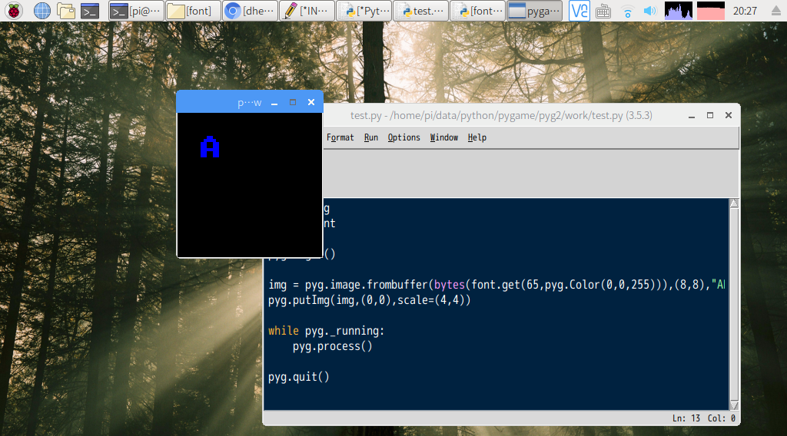

# bitmap fontがほしい

探してみたらパブリックドメインでソースを出している方がいらした。

[font8x8](https://github.com/dhepper/font8x8)

その中の```font8x8_basic.h```、0〜127のキャラクタ定義。（抜粋）


```c
    { 0x00, 0x00, 0x00, 0x00, 0x00, 0x00, 0x00, 0x00},   // U+0020 (space)
    { 0x18, 0x3C, 0x3C, 0x18, 0x18, 0x00, 0x18, 0x00},   // U+0021 (!)
    { 0x36, 0x36, 0x00, 0x00, 0x00, 0x00, 0x00, 0x00},   // U+0022 (")
    { 0x36, 0x36, 0x7F, 0x36, 0x7F, 0x36, 0x36, 0x00},   // U+0023 (#)
    { 0x0C, 0x3E, 0x03, 0x1E, 0x30, 0x1F, 0x0C, 0x00},   // U+0024 ($)
    { 0x00, 0x63, 0x33, 0x18, 0x0C, 0x66, 0x63, 0x00},   // U+0025 (%)
    { 0x1C, 0x36, 0x1C, 0x6E, 0x3B, 0x33, 0x6E, 0x00},   // U+0026 (&)

```

Cのソースだけれど簡単にPythonに書き直せるのでヤル。のだけどコメントやインデントが厄介なので取り除く。

```sh
cat font8x8_basic | sed s/"\/\/".*//g | sed s/"    "//g
```

あと、出来ればタプルのほうがありがたいのでタプルに変換しよう。 真面目に正規表現すれば1行で出来ると思うけど。

```sh
sed s/"{"/"("/g | sed s/"}"/")"/g
```


次にPythonから使えるようにタプルの入れ子にする。

一度外したインデントを再度いれるのもなんだかアレだけどまあ。

```python
#!/usr/bin/python3
font8x8_basic = (
	( 0x00, 0x00, 0x00, 0x00, 0x00, 0x00, 0x00, 0x00),   
	( 0x00, 0x00, 0x00, 0x00, 0x00, 0x00, 0x00, 0x00),   
	( 0x00, 0x00, 0x00, 0x00, 0x00, 0x00, 0x00, 0x00),   
	( 0x00, 0x00, 0x00, 0x00, 0x00, 0x00, 0x00, 0x00),   
	( 0x00, 0x00, 0x00, 0x00, 0x00, 0x00, 0x00, 0x00),   
	( 0x00, 0x00, 0x00, 0x00, 0x00, 0x00, 0x00, 0x00),   
	..(略)..
```

こうして1bit階調のデータをasciiコードで引き出せるようになった。

次にこれをどうやって使うか考える必要がある。

色を指定してbitが1のところを置き換えてもらえばいいかと思った。

透明部分について考える必要があるけれどひとまず1以外のところはRGBA=0として扱って透明だと困るならそれなりの処理を自前で別途実装という形で。

```python
def get(asc,color):
	buf = [0]*64
	data = font8x8_basic[asc]
	for j in range(8):
		for i in range(8):
			if (data[j] >> i) & 1 != 0:
				buf[j*8+i] = color
			else:
				buf[j*8+i] = 0
	return buf
```

ということでデータのデコーダというかコンバータというかを作った。

pygから使おうとする。

```python
>>> img = font.get(65,pyg.Color(255,0,0))
>>> img
[0, 0, (255, 0, 0, 255), (255, 0, 0, 255), 0, 0, 0, 0, 0, (255, 0, 0, 255), (255, 0, 0, 255), (255, 0, 0, 255), (255, 0, 0, 255), 0, 0, 0, (255, 0, 0, 255), (255, 0, 0, 255), 0, 0, (255, 0, 0, 255), (255, 0, 0, 255), 0, 0, (255, 0, 0, 255), (255, 0, 0, 255), 0, 0, (255, 0, 0, 255), (255, 0, 0, 255), 0, 0, (255, 0, 0, 255), (255, 0, 0, 255), (255, 0, 0, 255), (255, 0, 0, 255), (255, 0, 0, 255), (255, 0, 0, 255), 0, 0, (255, 0, 0, 255), (255, 0, 0, 255), 0, 0, (255, 0, 0, 255), (255, 0, 0, 255), 0, 0, (255, 0, 0, 255), (255, 0, 0, 255), 0, 0, (255, 0, 0, 255), (255, 0, 0, 255), 0, 0, 0, 0, 0, 0, 0, 0, 0, 0]
```

おっと…。

というかPyGameでイメージを配列から作るにはRGBA配列じゃないといけないからそもそもコレじゃダメだった。

```python
def get(asc,color):
	buf = [0]*64*4
	data = font8x8_basic[asc]
	for j in range(8):
		for i in range(8):
			idx = (j*8+i)*4
			if (data[j] >> i) & 1 != 0:
                                buf[idx]   = color[1]
                                buf[idx+1] = color[2]
                                buf[idx+2] = color[3]
                                buf[idx+3] = color[0]                               
			else:
				for k in range(4):
					buf[idx+k] = 0
	return buf
```

これで正解。
毎回思うのだけどRGBAの順でPyGameに値を渡すと順序がむっちゃくちゃでまともに画像が表示できない。ややこしい。
ただ、ファイルから読むとかだと正しく動くので単にエンディアンの都合だと思うけども。

一応上のコードでは pyg.Color とか pygame.Color で値を渡せば意図通りの色で動作するようになってる。


# サンプルコード

```python
import pyg
import font

pyg.begin()

img = pyg.image.frombuffer(bytes(font.get(65,pyg.Color(0,0,255))),(8,8),"ARGB")
pyg.putImg(img,(0,0),scale=(4,4))

while pyg._running:
    pyg.process()

pyg.quit()
```



こんな感じで無事にフォント表示ができました。

